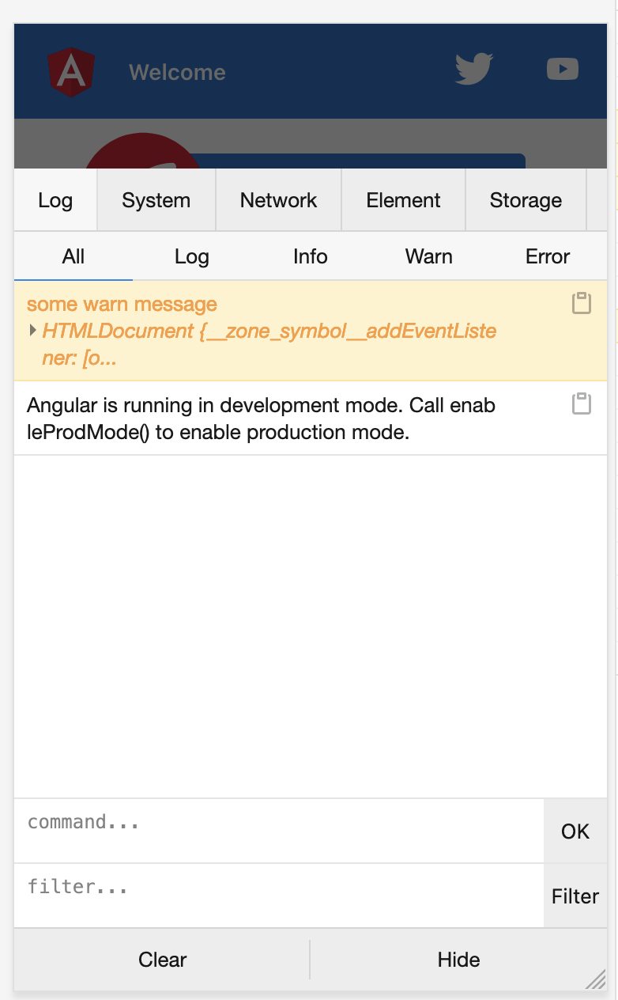

# NgxVconsoleLogger

A simple vConsole integration for angular. 



### Install

```shell
npm i ngx-vconsole-logger --save
```

### Usage

* Build time configure:

```ts
import {NgxVConsoleLoggerModule} from "ngx-vconsole-logger";

@NgModule({
  declarations: [
    AppComponent
  ],
  imports: [
    BrowserModule,
    AppRoutingModule,
    // debug option, set false to clear the log info in production.
    NgxVConsoleLoggerModule.register(true),  // use environment vars
  ],
  providers: [],
  bootstrap: [AppComponent]
})
export class AppModule { }
```

Import the module will not trigger the vconsole because of the lazy load,
so you must log some information.

```ts
import {IVconsoleLogger, NGX_VCONSOLE_LOGGER} from "ngx-vconsole-logger";

@Component({
  selector: 'app-root',
  templateUrl: './app.component.html',
  styleUrls: ['./app.component.scss']
})
export class AppComponent implements OnInit {
  title = 'playground';

  constructor(
    @Inject(NGX_VCONSOLE_LOGGER) private ngxLogger: IVconsoleLogger
  ) {}

  ngOnInit() {
    this.ngxLogger.warn("some warn message", document);
  }
}
```

* Configure in runtime

```ts
import {NGX_VCONSOLE_LOGGER_OPTIONS, ngxVconsoleLoggerFactory} from "ngx-vconsole-logger";

@Component({
  selector: 'app-root',
  templateUrl: './app.component.html',
  styleUrls: ['./app.component.scss'],
  providers: [
    {
      provide: NGX_VCONSOLE_LOGGER_OPTIONS,
      useValue: {debug: false} // use useFactory to decide the debug status in runtime
    },
    {
      provide: NGX_VCONSOLE_LOGGER,
      useFactory: ngxVconsoleLoggerFactory,
      deps: [NGX_VCONSOLE_LOGGER_OPTIONS]
    }
  ]
})
export class AppComponent implements OnInit {
  title = 'playground';

  constructor(
    @Inject(NGX_VCONSOLE_LOGGER) private ngxLogger: IVconsoleLogger
  ) {}

  ngOnInit() {
    this.ngxLogger.warn("some warn message", document);
  }
}
```
